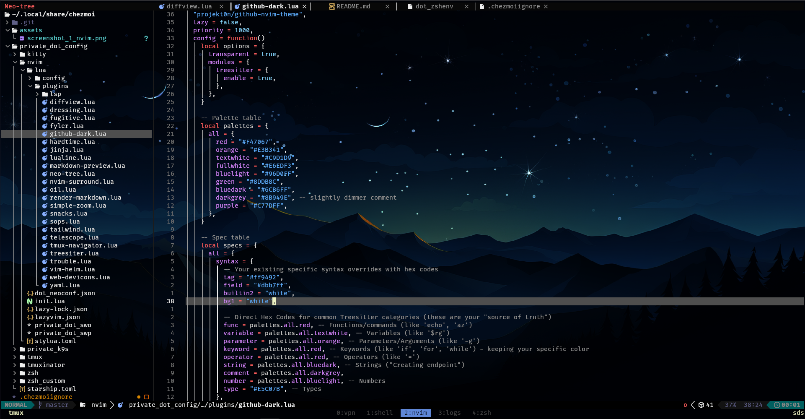
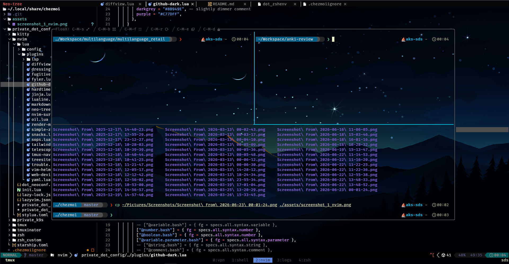

# 🛠️ Dotfiles

Personal configuration for my development environment.

## Preview

### Neovim (theme)


### Floax integration (shell workflow)



## Contents
- Shell: [zsh](https://www.zsh.org/) + [oh my zsh](https://ohmyz.sh/)
- Terminal: [kitty](https://sw.kovidgoyal.net/kitty/)
- Multiplexer: [tmux](https://github.com/tmux/tmux)
- Git UI: [lazygit](https://github.com/jesseduffield/lazygit)
- Editor: [neovim](https://neovim.io/)
- Kubernetes UI: [k9s](https://k9scli.io/)
- Prompt: [starship](https://starship.rs/)
- Dotfiles manager: [chezmoi](https://www.chezmoi.io/)

## Setup

```bash
mkdir -p ~/.local/bin
sh -c "$(curl -fsLS get.chezmoi.io/lb)" -- init --apply Mr-Folder
